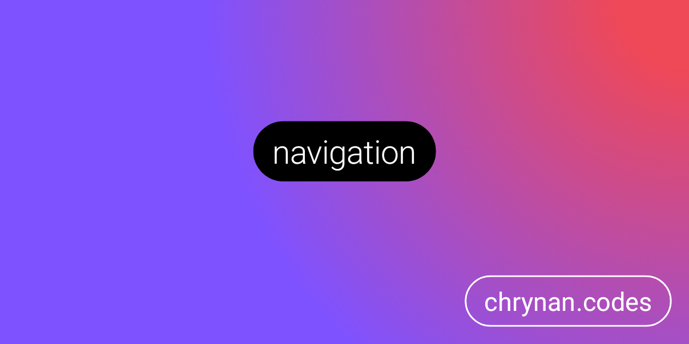

# navigation

Kotlin multi-platform application navigation library that supports Jetpack Compose. <br/><br/>


```kotlin
val navigator = rememberNavigator(initialDestination = "Greeting")

NavigationContainer(navigator) { destination ->
    when (destination) {
        "Greeting" -> Column {
            Text("Hello")

            Button(onClick = { navigator.goTo("Farewell") }) {
                Text("Say Goodbye")
            }
        }
        "Farewell" -> Text("Good-bye")
        else -> Text("Unexpected Destination: $destination")
    }
}
```

## Getting Started 🏁

The library is provided through [Repsy.io](https://repsy.io/). Checkout
the [releases page](https://github.com/chRyNaN/navigation/releases) to get the latest version. <br/>


### Repository

```groovy
repositories {
    maven {
        url = uri("https://repo.repsy.io/mvn/chrynan/public")
    }
}
```

### Dependencies

#### core

```groovy
implementation("com.chrynan.navigation:navigation-core:VERSION")
```

#### compose

```groovy
implementation("com.chrynan.navigation:navigation-compose:VERSION")
```

## Usage 👨‍💻

### Destinations

`NavigationDestinations` represent the locations within an application that a `Navigator` can coordinate. They can be of
any type and can contain any data that is useful to render the destination UI. A common approach is to use enums or
sealed classes to represent the different `NavigationDestinations` within an application.

```kotlin
enum class AppDestination {

    HOME,
    SEARCH,
    SETTINGS,
    DETAILS
}
```

### Contexts

A `NavigationContext` is a way of representing complex or nested navigation destinations. A `NavigationContext` defines
its `initialDestination` and has its own stack of `NavigationDestinations` associated with it within the internal
implementation of a `Navigator`. This allows there to be a stack of stacks of `NavigationDestinations` for an
application.

```kotlin
enum class MainContext(
    override val initialDestination: AppDestination,
    val title: String,
    val icon: ImageVector
) : NavigationContext<AppDestination> {

    HOME(title = "Home", icon = Icons.Default.Home, initialDestination = AppDestination.Home),

    SEARCH(title = "Search", icon = Icons.Default.Search, initialDestination = AppDestination.Search),

    SETTINGS(title = "Settings", icon = Icons.Default.Settings, initialDestination = AppDestination.Settings)
}
```

### Navigator

A `Navigator` is used to navigate between navigation contexts and destinations via the
convenient `goTo`, `changeContext`, and `goBack` functions. A `Navigator` can be obtained via one of the constructor
functions or the `remember`/`rememberSavable` functions when using Jetpack Compose/Multiplatform Compose.

```kotlin
val navigator = rememberNavigator(initialDestination = AppDestination.HOME)

BackHandler { navigator.goBack() }

ListItem(modifier = Modifier.clickable { navigator.goTo(AppDestination.DETAILS) })
```

### NavigationContainer

The `NavigationContainer` composable provides a convenient way to listening to destination and context state changes and
recomposing its content accordingly. Just provide a `Navigator` instance and a content composable.

```kotlin
@Composable
fun App() {
    val navigator = rememberNavigator(initialDestination = AppDestination.HOME)

    NavigationContainer(navigator = navigator) { destination ->
        when (destination) {
            AppDestination.HOME -> HomeScreenComposable()
            AppDestination.SEARCH -> SearchScreenComposable()
            AppDestination.SETTINGS -> SettingsScreenComposable()
            AppDestination.DETAILS -> DetailsScreenComposable()
        }
    }
}
```

### Transitions and animations

You have complete control over the composable functions that render the UI of the application and can use the Jetpack
Compose library's transition and animation APIs to change between the navigation context and destination UIs. For more
fine-grained control, create a custom composable replacing the `NavigationContainer` that handles transitions properly
for your application. Then just listen and react to the `Navigator.state` changes.

```kotlin
@Composable
fun <Destination : NavigationDestination, Context : NavigationContext<Destination>> MyNavContainer(
    navigator: Navigator<Destination, Context>,
) {
    val context = navigator.store.context.collectAsState()
    val destination = navigator.store.destination.collectAsState()

    // Render UI from context and destination values and apply any transition or animation desired.
}
```

### Best Practices

* Avoid passing a `Navigator` to `@Composable` functions and
  instead [hoist the state](https://developer.android.com/jetpack/compose/state-hoisting).

```kotlin
@Composable
fun App() {
    val navigator = rememberNavigator(...)

    ...

    MyScreen(
        onBackPressed = { navigator.goBack() },
        onGoToDetails = { navigator.goTo(AppDestination.Details(it)) }
    )
}
```

* Use different `Navigators` for deep nested navigation. This way each component can retain its own navigation hierarchy
  and delegate to its encapsulating component via state hoisting if it cannot handle the navigation.

```kotlin
@Composable
fun ParentComponent() {
    val parentNavigator = rememberNavigator(...)

    ...

    ChildComponent(onBack = { parentNavigator.goBack() })
}

@Composable
fun ChildComponent(
    onBack: () -> Unit
) {
    val childNavigator = rememberNavigator(...)

    BackHandler {
        if (!childNavigator.goBack()) {
            onBack.invoke()
        }
    }
}
```

* Use the `rememberSavableNavigator` function along with serializable navigation destinations and contexts to retain the
  navigation state between configuration changes.

```kotlin
val navigator = rememberSavableNavigator(
    initialContext = MainContext.HOME,
    destinationSerializer = AppDestination.serializer(),
    contextSerializer = MainContext.serializer()
)
```

* Create the `Navigator` instance outside of `@Composable` functions to handle navigation outside the user interface
  flow, such as in Activity lifecycle callbacks.

```kotlin
val navigator = Navigator(initialContext = MainContext.HOME)
```

* Utilize [side-effects](https://developer.android.com/jetpack/compose/side-effects) in Jetpack Compose for handling
  navigation to non-composable UI components, such as starting new Activities or changing Fragments.

```kotlin
NavigationContainer(navigator) { destination ->
    when (destination) {
        is AppDestination.Details -> LaunchedEffect(destination) {
            context.startActivity(DetailsActivity.newIntent(context, destinatin.id))
        }
    }
}
```

* Utilize [kotlinx serialization](https://github.com/Kotlin/kotlinx.serialization) and
  the [serialization-parcelable](https://github.com/chRyNaN/serialization-parcelable) library to transfer a `Navigator`
  between components.

```kotlin
val navigatorSerializer = Navigator.serializer(destinationSerializer, contextSerializer)

parcelable.encodeToParcel(serializer = navigatorSerializer, value = navigator)
json.encodeToString(serializer = navigatorSerializer, value = navigator)
```

## Documentation 📃

More detailed documentation is available in the [docs](docs/) folder. The entry point to the documentation can be
found [here](docs/index.md).

## Security 🛡️

For security vulnerabilities, concerns, or issues, please responsibly disclose the information either by opening a
public GitHub Issue or reaching out to the project owner.

## Contributing ✍️

Outside contributions are welcome for this project. Please follow the [code of conduct](CODE_OF_CONDUCT.md)
and [coding conventions](CODING_CONVENTIONS.md) when contributing. If contributing code, please add thorough documents.
and tests. Thank you!

## Sponsorship ❤️

Support this project by [becoming a sponsor](https://www.buymeacoffee.com/chrynan) of my work! And make sure to give the
repository a ⭐

## License ⚖️

```
Copyright 2021 chRyNaN

Licensed under the Apache License, Version 2.0 (the "License");
you may not use this file except in compliance with the License.
You may obtain a copy of the License at

   http://www.apache.org/licenses/LICENSE-2.0

Unless required by applicable law or agreed to in writing, software
distributed under the License is distributed on an "AS IS" BASIS,
WITHOUT WARRANTIES OR CONDITIONS OF ANY KIND, either express or implied.
See the License for the specific language governing permissions and
limitations under the License.
```
